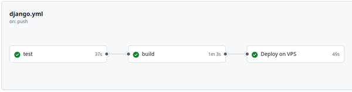

.. OC Lettings Site documentation master file, created by ylxdre
   sphinx-quickstart on Tue Sep 23 11:01:06 2025.
   You can adapt this file completely to your liking, but it should at least
   contain the root `toctree` directive.

==============================
OC Lettings Site documentation
==============================

.. toctree::
   :maxdepth: 2
   :caption: Contents:

Abstract
========

   
This Django project is an exercice and a part of the OCR Project 13. It's a basic application displaying a list of fictive estate properties and a list of users. 

The goal was first to :

- rework the architecture, fix linting, some issues, add docstrings and write tests
- set up a CI/CD pipeline running tests, packaging and deployment

Architecture
============

| At first, project contained only one application. 
| It was splitted into two mains ``profiles`` and ``lettings`` which contain the following files : 

* profiles
    * views
    * models
    * templates
* lettings
    * views
    * models
    * templates
    
.. important::
    the `'settings.py'` file and the index base template and view are located under the base ``oc_lettings_site`` app

Models, as usual, are manageable from the admin page.

Models and DB
-------------

Lettings application
^^^^^^^^^^^^^^^^^^^^
Two objects :
 
- Address

	- *attributs* : number, street, city, state, zip_code, country_iso_code
	
- Letting

	- *attributs* : title, address (OneToOneField to Address)

Profiles application
^^^^^^^^^^^^^^^^^^^^
One object : 

- Profile

	- *attributs* : user (OneToOneField to User), favorite_city

Tables
^^^^^^

.. code-block::

	sqlite> pragma table_info(lettings_address);
	0|id|INTEGER|1||1
	1|number|integer unsigned|1||0
	2|street|varchar(64)|1||0
	3|city|varchar(64)|1||0
	4|state|varchar(2)|1||0
	5|zip_code|integer unsigned|1||0
	6|country_iso_code|varchar(3)|1||0
	
	sqlite> pragma table_info(lettings_letting);
	0|id|INTEGER|1||1
	1|title|varchar(256)|1||0
	2|address_id|INTEGER|1||0
	
	sqlite> pragma table_info(Profiles_profile);
	0|id|INTEGER|1||1
	1|favorite_city|varchar(64)|1||0
	2|user_id|INTEGER|1||0

Tests
-----

| Tests are located in the ``tests`` directory, in the ``unit`` subdirectory.
| Then, there is a subfolder for every application, containing three files : `test_models`, `test_urls`, `test_views`

Temporary db (popuplated with some sample objects) is created for testing purpose; you can see fixtures used for this in the ``conftest.py``.

Fixed issues
------------
| Linting is PEP8 compliant, see the HTML report in flake-report
| Plural of Address objects appears now well on admin (addresses, with a Meta method)
| There are 404 and 500 custom html template
| Every class or function has doctrings
| Test coverage is 100%

.. code-block::

    ========================= tests coverage ==========================
    _______ coverage: platform linux, python 3.11.0-candidate-1 _______

    Name                        Stmts   Miss  Cover
    -----------------------------------------------
    lettings/models.py             18      0   100%
    lettings/views.py              16      0   100%
    oc_lettings_site/views.py       3      0   100%
    profiles/models.py              7      0   100%
    profiles/views.py              16      0   100%
    -----------------------------------------------
    TOTAL                          60      0   100%
    ================ 15 passed, 1024 warnings in 0.87s ================

Install the project
===================

Requirements
------------

- A github account with read access to this repo
- Git CLI 
- SQLite3 CLI 
- Python 3.9 or higher
- poetry

Clone the repository
--------------------

.. code-block::

	cd /path/to/put/project/in
	git clone https://github.com/OpenClassrooms-Student-Center/Python-OC-Lettings-FR.git
	

Activate virtual environment
----------------------------

.. code-block::

	cd /path/to/OCR-P13-CI-CD
	poetry env use python3.11
	poetry env activate and run the command displayed

To deactivate, just run ``deactivate``

Launch the site
---------------

| ``cd /path/to/OCR-P13-CI-CD``
| ``poetry env activate``

- and run the command displayed 

| ``poetry add $(cat requirements.txt)``
| ``python manage.py runserver``

- Then go on ``http://localhost:8000``

Quickstart
==========

Populate the DB : add data
--------------------------

The easiest way is to do it from the admin panel

| Connect to ``http://localhost:8000/admin`` 
| with ``admin`` and ``Abc1234!``

.. important::

	note that this password has been changed on the published packages 

Logging in Sentry
=================
On render detailed profile or detailed letting, empty queryset raises an exception not catched by default. So a try-except block is inserted, and a logger is called to log this error in sentry;

.. image:: _static/screenSentry.png

In order to enable logging in Sentry, you need to have a Sentry account, and set-up a new project as described here : 

`https://docs.sentry.io/product/sentry-basics/integrate-frontend/create-new-project/ <https://docs.sentry.io/product/sentry-basics/integrate-frontend/create-new-project/>`_

CI/CD
=====

github
------

| The automated flow is made with Github Actions, available there: 
| `https://github.com/ylxdre/OCR-P13-CI-CD/actions <https://github.com/ylxdre/OCR-P13-CI-CD/actions>`_

.. note::
	The workflow isn't hosted on the "main" branch, but on "github-actions"

The main workflow contains the following jobs :

1. The **test** runs pytest and leads to build only if tests succeed. 

2. The **build** uses the ``docker/build-push-action`` to build the docker image and push it on the Github Registry

3. The **deploy** connects to the VPS and launches the local docker-compose file to pull the image from the Github registry and run it with variables given from a local file, like Django secret key and the Sentry URL containing API key.

Once deployment is done, the application is reachable through this URL : 

* `http://ocr-p13.needsome.coffee:3000 <http://ocr-p13.needsome.coffee:3000>`_

 

gitlab
------

There's also a Gitlab pipeline which runs test and build/push a docker image on the Gitlab registry and another on the Docker Hub.

If you're logged into your Gitlab account, you can take a look to them here : 

- `gitlab pipelines <https://gitlab.com/yal-ocr-projects/p13/-/pipelines?scope=branches>`_

Docker
======
This section describes the steps you have to do if you want to deploy the app on your own -locally- to test it.

1. Install docker
-----------------

| First, you want to make sure you've docker installed. 
| Refer to this page for that : `https://docs.docker.com/engine/install/ <https://docs.docker.com/engine/install/>`_

2. Retrieve the image 
---------------------

To get the latest docker image of OC Lettings Site from the DockerHub, run the following command : 

.. code-block::
	
	docker pull 0yal0/oc_lettings_site:latest
	
3. Set your env variables
-------------------------

Create a file named, for example, ``docker-env`` containing the following variables with this syntax :
 
.. code-block::

	SENTRY_URL=https://XXXXXXXXXXXXXX.ingest.de.sentry.io/XXXXXXXXXXXX
	DJANGO_SECRET_KEY=XXXXXXXXXXXXXXXXXX
	

**SENTRY_URL** is the link provided when you activate the project in your Sentry account
It's used to log several errors described in the next section

**DJANGO_SECRET_KEY** is the key used by django to make some hashes 

	'`A secret key for a particular Django installation. This is used to provide cryptographic signing, and 		should set to a unique, unpredictable value.`'
	
See `this Django doc page <https://docs.djangoproject.com/en/5.2/ref/settings/#secret-key>`_ for more details

4. Run your container
---------------------

Then exec the following command : 

.. code-block::

	docker run --env-file docker-env -p 80:80 --name my-name 0yal0/oc_lettings_site:latest 

Then access to the app with your favorite browser using this URL :   ``http://localhost``

