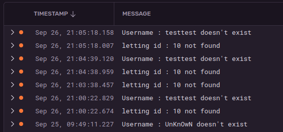

.. OC Lettings Site documentation master file, created by
   sphinx-quickstart on Tue Sep 23 11:01:06 2025.
   You can adapt this file completely to your liking, but it should at least
   contain the root `toctree` directive.

==============================
OC Lettings Site documentation
==============================

--------------
ylxdre OCR P13
--------------

.. toctree::
   :maxdepth: 3
   :caption: Contents:

Architecture
============

This Django project contains two main applications, with the following files  :

* profiles
    * views
    * models
    * templates
* lettings
    * views
    * models
    * templates
.. important::
    the `'settings.py'` file and the index base template and view are located under the base ``oc_lettings_site`` app

Models, as usual, are manageable from the admin page.

Tests
-----

| Tests are located in the ``tests`` directory, in the ``unit`` subdirectory.
| Then, there is a subfolder for every application, containing three files : `test_models`, `test_urls`, `test_views`
Temporary db (popuplated with some sample objects) is created for testing purpose; you can see fixtures used for this
in the ``conftest.py``.

Fixed issues
------------
| Linting is PEP8 compliant, see the HTML report in flake-report
| Plural of Address objects appears now well on admin (addresses, with a Meta method)
| There are 404 and 500 custom html template
| Every class or function has doctrings
| Test coverage is 100%

.. code-block::

    ========================= tests coverage ==========================
    _______ coverage: platform linux, python 3.11.0-candidate-1 _______

    Name                        Stmts   Miss  Cover
    -----------------------------------------------
    lettings/models.py             18      0   100%
    lettings/views.py              16      0   100%
    oc_lettings_site/views.py       3      0   100%
    profiles/models.py              7      0   100%
    profiles/views.py              16      0   100%
    -----------------------------------------------
    TOTAL                          60      0   100%
    ================ 15 passed, 1024 warnings in 0.87s ================

Logging in Sentry
=================
On render detailed profile or detailed letting, empty queryset raises an exception not catched by default. So a
try-except block is inserted, and a logger is called to log this error in sentry;

CI/CD
=====
The main Github workflow contains the following actions :

- 
The pipeline has basically two main sections : test, and packaging/deploy (docker build and docker push)
Project has CI on Gitlab and on Github. Both are distinguished by specific branches as described in the following
sections

github
------
On the following repo :
The related branch is github-action o

gitlab
------

Docker
======
| You can retrieve the latest docker image from the DockerHub with the following command :

..  code-block::

    docker pull 0yal0/oc_lettings_site:latest

